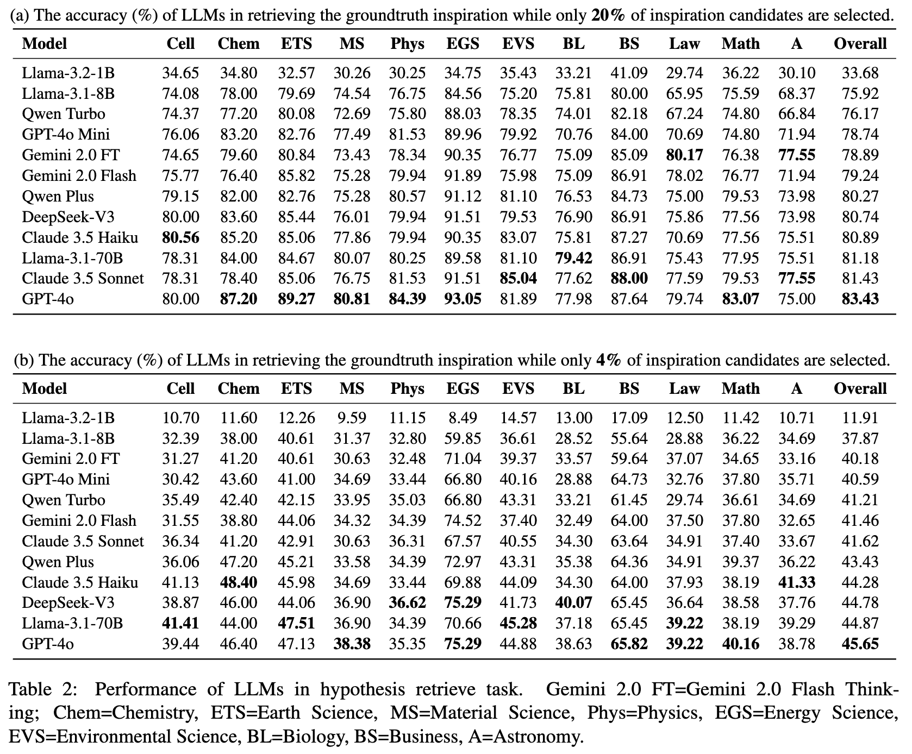
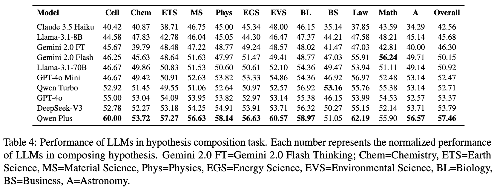
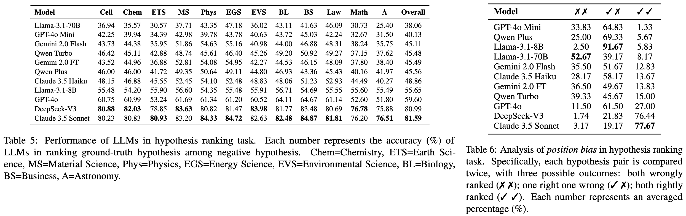

# ResearchBench

<p align="center">
  <a href="https://arxiv.org/abs/2503.21248"></a>
  <a href="https://ankitala.github.io/ResearchBench/"></a>
  <a href="https://huggingface.co/datasets/ankilok/ResearchBench"></a>
  <a href="https://github.com/ankitala/ResearchBench"></a>
</p>

[English](README.md) | [中文](README_zh.md)

ResearchBench 是 ACL Findings 2026 论文 [ResearchBench: Benchmarking LLMs in Scientific Discovery via Inspiration-Based Task Decomposition](https://arxiv.org/abs/2503.21248) 的官方开源代码。

这个 GitHub 仓库包含评测工具、命令行接口、prompt、指标、测试，以及 12 条样本的 `tiny` smoke-test 子集。完整 benchmark 数据集发布在 [Hugging Face](https://huggingface.co/datasets/ankilok/ResearchBench)：[ankilok/ResearchBench](https://huggingface.co/datasets/ankilok/ResearchBench)。

ResearchBench 围绕三个 inspiration-based 子任务评估大语言模型的科学发现能力：

1. **灵感检索（Inspiration Retrieval）**：从候选论文中找出能启发目标研究假设的论文。
2. **假设组合（Hypothesis Composition）**：基于研究问题和 gold inspirations 组合出研究假设。
3. **假设排序（Hypothesis Ranking）**：在 gold hypothesis 和 negative hypotheses 之间做成对比较，判断哪个更优。

完整发布版本包含 **1,369 条论文记录**、**1,367 条检索任务**、**1,367 条生成任务**和 **1,323 条排序任务**。

## 🚀 Quick Start

先 clone 代码仓库，然后直接使用仓库内置的 `data/tiny/*.jsonl` smoke-test 子集，用 OpenAI-compatible provider 运行三个子任务：

```bash
git clone https://github.com/ankitala/ResearchBench.git
cd ResearchBench

python -m pip install -e ".[openai]"

export OPENAI_API_KEY="<your-api-key>"
export OPENAI_BASE_URL="<your-base-url>"
MODEL="<model-name>"

researchbench run-retrieve --data data/tiny/retrieve.jsonl --model-name "$MODEL" --concurrency 15 --out outputs/retrieve_tiny.jsonl
researchbench score-retrieve --pred outputs/retrieve_tiny.jsonl --data data/tiny/retrieve.jsonl

researchbench run-generate --data data/tiny/generation.jsonl --model-name "$MODEL" --num-mutations 2 --num-itr-self-refine 1 --concurrency 15 --out outputs/generation_tiny.jsonl
researchbench score-generate --pred outputs/generation_tiny.jsonl --data data/tiny/generation.jsonl --judge-model "$MODEL" --concurrency 15

researchbench run-rank --data data/tiny/ranking.jsonl --model-name "$MODEL" --order both --concurrency 15 --out outputs/ranking_tiny.jsonl
researchbench score-rank --pred outputs/ranking_tiny.jsonl
```

## 📊 Benchmark Results

下图总结了模型在 ResearchBench 三个子任务上的表现。分数越高表示表现越好。

### 🔍 Inspiration Retrieval



### 💡 Hypothesis Composition



### 🏆 Hypothesis Ranking



## ⚙️ 安装

ResearchBench 需要 Python 3.10 或更高版本。

核心安装：

```bash
python -m pip install -e .
```

开发与测试：

```bash
python -m pip install -e ".[dev]"
```

使用 OpenAI-compatible 模型服务：

```bash
python -m pip install -e ".[openai]"
export OPENAI_API_KEY="<provider-api-key>"
export OPENAI_BASE_URL="<provider-base-url>"
```

也可以在命令行中直接传入服务商参数：

```bash
researchbench run-retrieve \
  --data data/tiny/retrieve.jsonl \
  --model-name "<provider-model-name>" \
  --api-key "<provider-api-key>" \
  --base-url "<provider-base-url>" \
  --concurrency 15 \
  --out outputs/retrieve_provider.jsonl
```

`pyproject.toml` 是权威包配置。`requirements.txt` 是便捷安装文件，用于安装 editable package、开发依赖和 OpenAI-compatible provider 依赖。

<a id="data-layout"></a>

## 🗂️ 数据结构

这个 GitHub 仓库以代码为主，只跟踪用于 smoke test 的小规模 `tiny` JSONL 文件：

- `data/tiny/papers.jsonl`：12 条样本的论文记录。
- `data/tiny/retrieve.jsonl`：12 条样本的灵感检索任务。
- `data/tiny/generation.jsonl`：12 条样本的假设组合任务。
- `data/tiny/ranking.jsonl`：12 条样本的假设排序任务。

完整 benchmark 文件托管在 [Hugging Face](https://huggingface.co/datasets/ankilok/ResearchBench)，不会上传到 GitHub：

- `papers/papers.jsonl`：标准化论文记录。
- `retrieve/retrieve.jsonl`：灵感检索任务。
- `generation/generation.jsonl`：假设组合任务。
- `ranking/ranking.jsonl`：假设排序任务。
- `validation/*.csv` 和 `validation/*.json`：构建与校验报告。

按需下载任意 subset：

```bash
huggingface-cli download ankilok/ResearchBench \
  --repo-type dataset \
  --include "retrieve/*.jsonl" \
  --include "generation/*.jsonl" \
  --include "ranking/*.jsonl" \
  --local-dir data
```

校验本地数据目录：

```bash
researchbench validate data
```

校验内容包括：候选数量、gold 标签覆盖、空字段、本机绝对路径、API key 泄漏和任务结构约束。

## 🛠️ 基本用法

所有 `run-*` 命令支持 `--concurrency` 参数，默认为 15。`run-generate` 还支持 `--inner-concurrency` 用于样本内独立分支并行。如果服务商限速较紧，可以降低并发数。

**运行完整 benchmark 前，请先按照 [数据结构](#data-layout) 一节从 [Hugging Face](https://huggingface.co/datasets/ankilok/ResearchBench) 下载对应 JSONL 文件到 `data/`。**

### 🔍 灵感检索

```bash
researchbench run-retrieve \
  --data data/retrieve/retrieve.jsonl \
  --model-name "<model>" \
  --concurrency 15 \
  --out outputs/retrieve.jsonl

researchbench score-retrieve \
  --pred outputs/retrieve.jsonl \
  --data data/retrieve/retrieve.jsonl
```

默认参数对齐原论文实验：窗口大小 15，保留 3，两轮筛选，不使用 background survey，不基于相似度选择。第一轮从 75 个候选中保留 15 个，第二轮从 15 个中保留 3 个。

### 💡 假设组合

```bash
researchbench run-generate \
  --data data/generation/generation.jsonl \
  --model-name "<model>" \
  --num-mutations 2 \
  --num-itr-self-refine 2 \
  --max-inspiration-search-steps 3 \
  --concurrency 15 \
  --inner-concurrency 1 \
  --out outputs/generation.jsonl

researchbench score-generate \
  --pred outputs/generation.jsonl \
  --data data/generation/generation.jsonl \
  --judge-model "<judge-model>" \
  --concurrency 15
```

生成任务使用 `main_hypothesis` 作为 gold hypothesis。`fine_grained_hypothesis` 仅作为可选元数据保留。默认生成流程使用 gold inspirations、2 条 mutation 线、2 次 refinement 迭代、同源重组、最多 3 步跨源 inspiration 搜索、inter-EA 筛选窗口大小 12、保留 3，以及 recombination beam size 15。

### 🏆 假设排序

```bash
researchbench run-rank \
  --data data/ranking/ranking.jsonl \
  --model-name "<model>" \
  --order both \
  --concurrency 15 \
  --out outputs/ranking.jsonl

researchbench score-rank \
  --pred outputs/ranking.jsonl
```

`--order both` 评估正反两个比较方向。也可以使用 `--order gold-first` 或 `--order negative-first`。

## 📋 示例输出

检索评分：

```text
Retrieve score summary
- Round 1: kept 15 of 75 candidates
  - Gold inspiration hit ratio: 0.7419 (74.19%)
  - Negative tier 1 selection ratio: 0.5463 (54.63%)
  - Negative tier 2 selection ratio: 0.0833 (8.33%)
  - Negative tier 3 selection ratio: 0.0189 (1.89%)
- Round 2: kept 3 of 75 candidates
  - Gold inspiration hit ratio: 0.3548 (35.48%)
```

生成评分：

```text
Hypothesis generation score summary
- Scored samples: 12
- Average matched score (0-5): 4.1667
- Generation accuracy (average score / 5): 0.8333 (83.33%)
```

排序评分：

```text
Hypothesis ranking score summary
- Overall directional accuracy: 0.3750 (37.50%)
- Gold-first order accuracy (gold is candidate 1): 0.3333 (33.33%)
- Negative-first order accuracy (gold is candidate 2): 0.4167 (41.67%)
- Sample-level two-order outcomes
  - Gold wins in neither order: 0.5000 (50.00%); count=6
  - Gold wins in exactly one order: 0.2500 (25.00%); count=3
  - Gold wins in both orders: 0.2500 (25.00%); count=3
```

完整的机器可读指标对象会写入预测文件旁的 `*.score.json`；除非显式指定 `--out`。

## 📊 评测指标

- **检索 gold hit ratio**：被选中的 gold inspirations 数量 / gold 总数量。分别报告第一轮和第二轮。
- **检索 negative 选择比例**：各距离层级中被选中的 negative 候选比例，用于分析模型偏好。
- **生成 matched score**：评判模型给出的 0-5 分，衡量生成假设对 gold hypothesis 关键点的覆盖程度。
- **生成 accuracy**：平均 matched score / 5。
- **排序 directional accuracy**：单一方向下 gold hypothesis 是否胜出。
- **排序 two-order outcomes**：同一样本在正反两个方向下 gold 胜出的情况（均胜、单胜、均负）。
- **排序 order consistency**：成对比较中正反方向是否一致，用于检测 position bias。

## 📝 注意事项

- 完整 benchmark JSONL 文件通过 [Hugging Face 数据集仓库](https://huggingface.co/datasets/ankilok/ResearchBench) 发布，而不是通过这个 GitHub 仓库发布。
- 检索候选来自 `merge.json`；`d0.json`、`d1.json`、`d2.json`、`d3.json` 分别标记为 gold、negative tier 1、negative tier 2 和 negative tier 3。
- API key 请通过环境变量或 CLI 参数传入。

## ⚖️ 许可证

代码部分采用 MIT 许可证。数据集在 [Hugging Face](https://huggingface.co/datasets/ankilok/ResearchBench) 上以 CC BY-NC 4.0 协议面向非商业研究用途发布；详见 [DATA_LICENSE.md](DATA_LICENSE.md)。

## 📑 引用

如果你使用 ResearchBench，请引用：

```bibtex
@misc{liu2026researchbenchbenchmarkingllmsscientific,
      title={ResearchBench: Benchmarking LLMs in Scientific Discovery via Inspiration-Based Task Decomposition}, 
      author={Yujie Liu and Zonglin Yang and Tong Xie and Jinjie Ni and Ben Gao and Yuqiang Li and Shixiang Tang and Wanli Ouyang and Erik Cambria and Dongzhan Zhou},
      year={2026},
      eprint={2503.21248},
      archivePrefix={arXiv},
      primaryClass={cs.CL},
      url={https://arxiv.org/abs/2503.21248}, 
}
```
